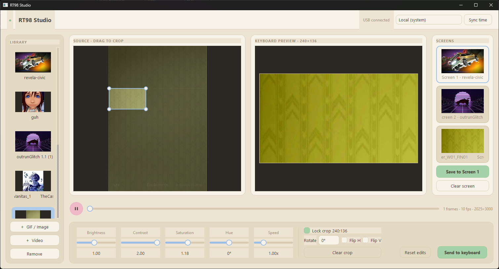

<p align="center">
  
</p>

<h1 align="center">RT98 Studio</h1>

<p align="center">
  A little desktop app for the EPOMAKER RT98's screen.<br>
  Set the date/time + put your own GIFs, images, and videos on it.
</p>

## What it does

- Sync the screen's clock to your computer, in local time or any time zone.
- Keep a no-limit library of GIFs (import GIFs, images, or video clips).
- Crop and adjust them (brightness, contrast, saturation, hue, speed) with a live
  preview of exactly what the screen will show.
- Send the result to the keyboard.

## Getting started

You'll need **Python 3.9+**. For sending GIFs you'll also want **Node.js**, and for
importing video, **ffmpeg**. All must be installed and on your PATH.

**Windows**

1. Double-click `setup.bat` (makes a local environment and installs everything).
2. Double-click `run.bat`.

**macOS / Linux**

```sh
./setup.sh
./run.sh
```

Then import a GIF, tweak it, and hit **Send to keyboard**.

## Good to know

- The screen has a few pages (clock, typing, GIF). Switch it to the GIF page to
  see what you sent.
- Sending a GIF rewrites the screen's storage. If it ever looks off, the official
  EPOMAKER tool will put it back.
- Tested on Windows. macOS and Linux should work too; if you're on one, a quick
  confirmation is welcome.

<details>
<summary>Under the hood</summary>

<br>

The screen is that little display sitting on top of the keyboard, just to the
right of F12. Electronically it shows up as its own USB device, separate from the
keyboard, so the app talks to it directly. The clock is set with a small command.
For GIFs, frames are resized to 240x136, packed into the screen's `qgif` format,
and written over USB with patient writes so the upload doesn't get cut off
mid-transfer.

The backend (device, encoding, image edits) lives in `rt98/`, and the PySide6
interface lives in `app/`. Both are kept separate, so the backend works on its own
if you'd rather script things.

</details>
